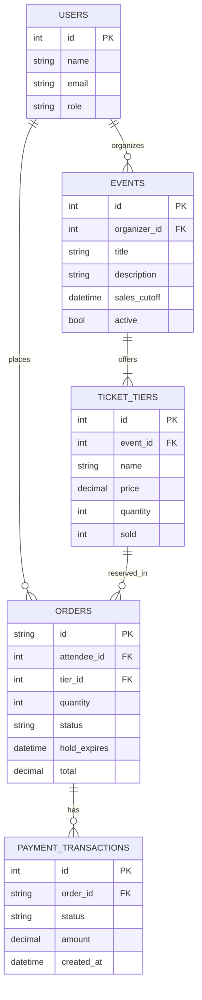

# ER Diagram

```mermaid
erDiagram
    USERS ||--o{ EVENTS : organizes
    USERS ||--o{ ORDERS : places
    EVENTS ||--|{ TICKET_TIERS : offers
    TICKET_TIERS ||--o{ ORDERS : reserved_in
    ORDERS ||--o{ PAYMENT_TRANSACTIONS : has

    USERS {
      int id PK
      string name
      string email
      string role
    }
    EVENTS {
      int id PK
      int organizer_id FK
      string title
      string description
      datetime sales_cutoff
      bool active
    }
    TICKET_TIERS {
      int id PK
      int event_id FK
      string name
      decimal price
      int quantity
      int sold
    }
    ORDERS {
      string id PK
      int attendee_id FK
      int tier_id FK
      int quantity
      string status
      datetime hold_expires
      decimal total
    }
    PAYMENT_TRANSACTIONS {
      int id PK
      string order_id FK
      string status
      decimal amount
      datetime created_at
    }
```
